## What I learned from Bob Mislevy

* Psychometric models are models for how people solve problems

  - Behaviorist Perspective
  
  - Social Constructivist (Adds new variables)
  
* Bayesian networks provides a visualization of a model

## Bayes nets basics

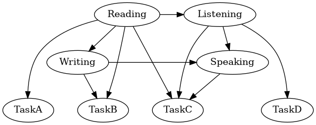


* Nodes represent variables

  - Latent Constructs/Proficiencies
  
  - Observable Outcomes from Tasks
  
* Edges represent dependencies

* _Separation in graph implies conditional independence_


## Causal Models

* Arrows go from hypothesized cause to effect.

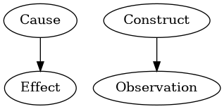

* Model reflects a causal theory

  - limited by variables in model (faithfulness)
  
## Information flows both ways

* Deduction -- Cause to effect

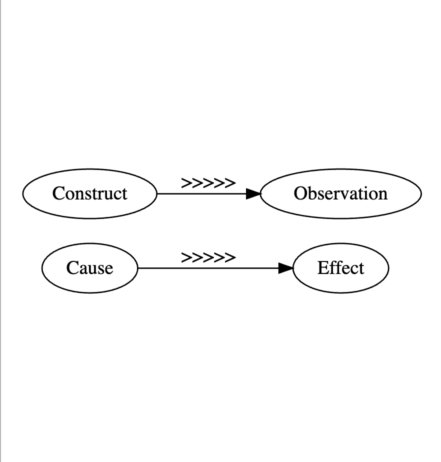

* Abduction -- Effect to cause

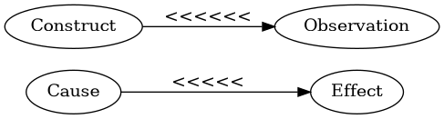

## Induction

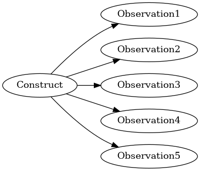

* Accumulates evidence from multiple sources

* Spans range of construct


## Common Causes 

[Accident Proneness](https://019d5a06-183a-cd3f-993f-930eae98c167.share.connect.posit.cloud/)

```{=html}
<iframe src="https://019d5a06-183a-cd3f-993f-930eae98c167.share.connect.posit.cloud/" style="width: 100%; height: 800px"></iframe>
```

## Item Response Theory as a Common Cause

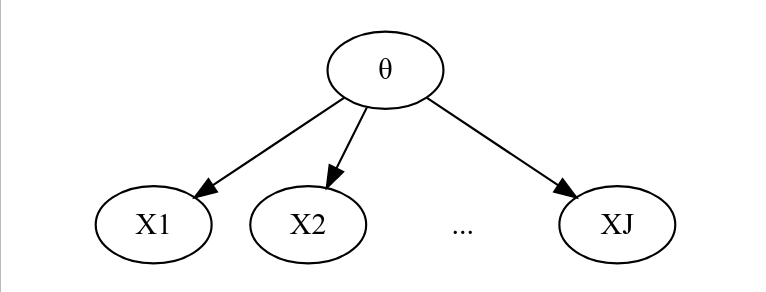

* Local item independence is conditional independence.

* Latent variable emerges from dependence among items.

  - Trait view of assessment
  
## Competing Explanations

* Observing a common descendant can induce dependency.

[Competing Explanations](https://019d5a07-c645-f5e8-1c65-38276db022e0.share.connect.posit.cloud/)

```{=html}
<iframe src="https://019d5a07-c645-f5e8-1c65-38276db022e0.share.connect.posit.cloud/" style="width: 100%; height: 800px"></iframe>
```


## Building a Language Model

Mislevy et al. (2002)

Start with a semantic model of the domain.

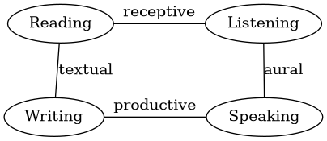

## Orient the edges

This is the (Student) Proficiency Model

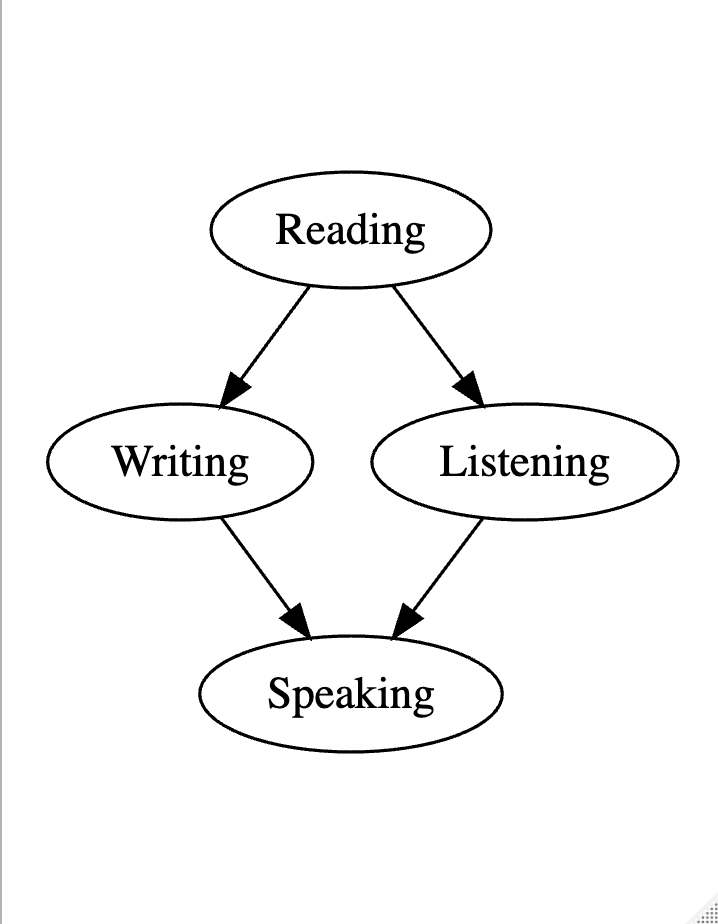

## A (Pure) Reading Task

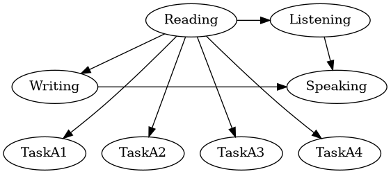

* Direct evidence for Reading

* Indirect evidence for Writing, Listening & Speaking

## A (Pure) Listening Task

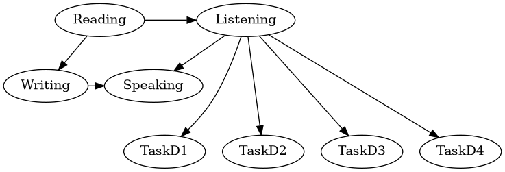

## A Reading/Writing Integrated Task

Task includes instructions, background material which must be read and a written response.

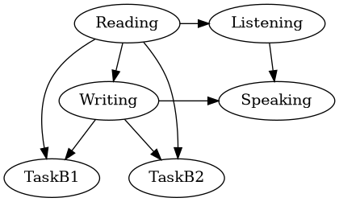

## A Reading/Listening/Speaking Task

Instructions must be read

Must listen to stimulus material

Must respond with either statement or question

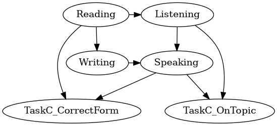


## The Full Language Model


A picture is worth 100 equations

Can communicate between cognitive scientists and psychometricians

Lifts the conversation to "which model is best"
